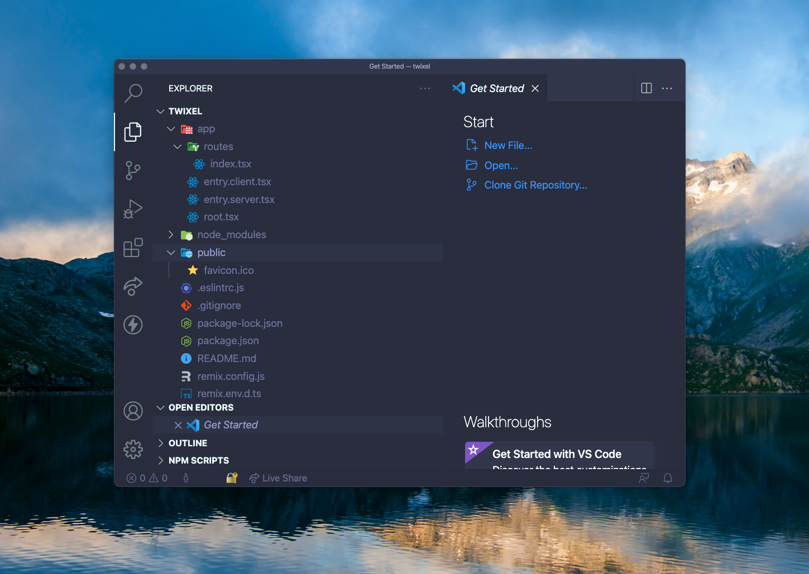
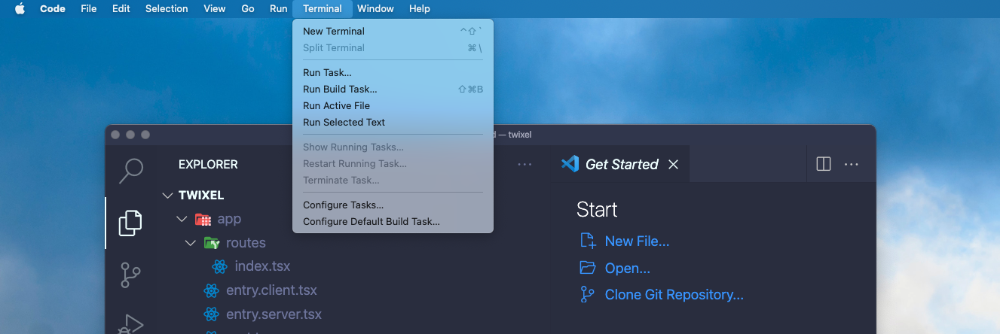
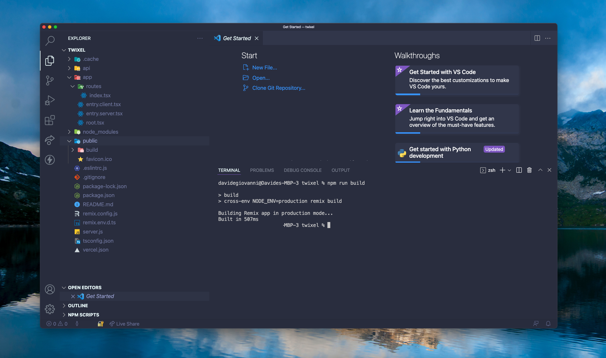

# Esplora la struttura del progetto

Una volta aperto il progetto, la struttura delle cartelle e dei file dovrebbe essere simile a questa:

```
twixel
├── README.md
├── app
│   ├── entry.client.tsx
│   ├── entry.server.tsx
│   ├── root.tsx
│   └── routes
│       └── index.tsx
├── package-lock.json
├── package.json
├── public
│   └── favicon.ico
├── remix.config.js
├── remix.env.d.ts
└── tsconfig.json
```



Parliamo dei file più importanti:

- `app/` - Questa cartella contiene tutto il codice di Remix, il framework che stiamo utilizzando per realizzare Twixel
- `app/entry.client.tsx` - Questo è il primo codice che verrà eseguito una volta aperto il sito sul browser. In questo file, Remix chiama una funzione di React chiamata "[hydrate](https://reactjs.org/docs/react-dom.html#hydrate)", che serve a "renderizzare" e sincronizzare i dati tra il browser (client) e il server (sito) che ospita il nostro sito.
- `app/entry.server.tsx` - Questo invece è il primo codice che viene eseguito quando un richiesta arriva dal browser al nostro server, Remix carica tutti i dati necessari e invia una risposta al browser.
- `app/root.tsx` - Qui metteremo la "root", ovvero il file principale, la radice, del nostro sito. Questo conterrà l'elemento "<[html](https://developer.mozilla.org/en-US/docs/Web/HTML/Element/html)>".
- `app/routes/` - Qui andranno le nostre "routes". Remix userà i file in questa cartella per creare vari URL (pagine) per il nostro sito basandosi sul nome dei file.
- `public/` - Qui andranno cose "statiche" (ovvero che non cambiano al cambiare dell'input) come immagini, font, etc.
- `remix.config.js` - Qui andranno delle configurazioni per il funzionamento di Remix.
<!-- TODO: forse dovremmo aggiungere una spiegazione di cos'è un server e cos'è un client -->

## 💡 Definizioni: Server e client

**Client**: tutti i dispositivi hardware e i software che accedono ai servizi erogati da un server dopo aver fatto delle richieste. I client sono "clienti" dei dati e servizi. Gmail è un client con cui accediamo al database di posta, oppure un computer che visualizza i dati meteo è un client che interroga il server del meteo per avere i suoi dati.

**Server**: tutti i dispositivi hardaware e software che forniscono dati e servizi richiesti dai client in risposta alle loro richieste. I server "servono" dati, informazioni e servizi. I server di Gmail contengono tutte le email e le informazioni di cui ogni client ha bisogno per leggere e mandare la posta, a esempio.

## Facciamo partire l'app

💿 Proviamo a eseguire una **build** nel nostro terminale. **Con "build" intendiamo la versione "costruita" dell'app.** Dentro Remix ci sono appositi comandi con cui a trasformare il nostro codice che stiamo sviluppando in codice che il server sarà in grado di eseguire. 

Dalla cartella `twixel` su Visual Studio Code apriamo un nuovo terminale - clicca `Terminale` nel menu contestuale in alto e poi `Nuovo terminale` dal menu a tendina. 



Nel nuovo terminale che abbiamo appena aperto, scrivi il seguente comando e clicca il tasto invio:

```sh
npm run build
```

Questo dovrebbe visualizzare sul terminale qualcosa di simile:

```
Building Remix app in production mode...
Built in 132ms
```

Oltre alle cartelle che abbiamo visto sopra, questo comando ha creato tre nuove cartelle:
- `.cache/` è una cartella usata internamente da Remix, per mantenere alcuni dati nella memoria del browser in modo da ottimizzare i tempi di caricamento,
-  `build/` contiene il codice che verrà eseguito sul server,
- `public/build` contiene il codice che verrà eseguito nel browser (ovvero il client) 



💿 Iniziamo fermando il server (premi CTRL+C nel terminale) e andiamo a cestinare queste cartelle:

- `app/routes`
- `app/styles`

Stiamo cercando di ridurre il codice generato al minimo inizialmente per poi andare a scriverlo noi passo passo.

💿 Rimpiazza i contenuti di `app/root.tsx` con questo:

```tsx filename=app/root.tsx
import { LiveReload } from "remix";

export default function App() {
  return (
    <html lang="en">
      <head>
        <meta charSet="utf-8" />
        <title>Remix: So great, it's funny!</title>
      </head>
      <body>
        Ciao mondo
        <LiveReload />
      </body>
    </html>
  );
}
```

> Il componente `<LiveReload />` è un componente di Remix Run ed è utile durante lo sviluppo per auto-aggiornare il browser ogni volta che facciamo un cambiamento. Questo a volte avviene talmente velocemente che nemmeno te ne accorgerai ⚡


La cartella `app/` ora dovrebbe contenere solo questi file:

```
app
├── entry.client.tsx
├── entry.server.tsx
└── root.tsx
```

💿 Con questo setup, avviamo il server di sviluppo con questo comando:

```sh
npm run dev
```

Apri [http://localhost:3000](http://localhost:3000) dovresti vedere "ciao mondo":


Ottimo! Ora siamo pronte per iniziare ad aggiungere contenuti.

## 🔍 Focus: i comandi che hai eseguito

* Avviare una versione di sviluppo dell'app: `npm run dev`
* Costruire la versione dell'app pronta per il server: `npm run build`
