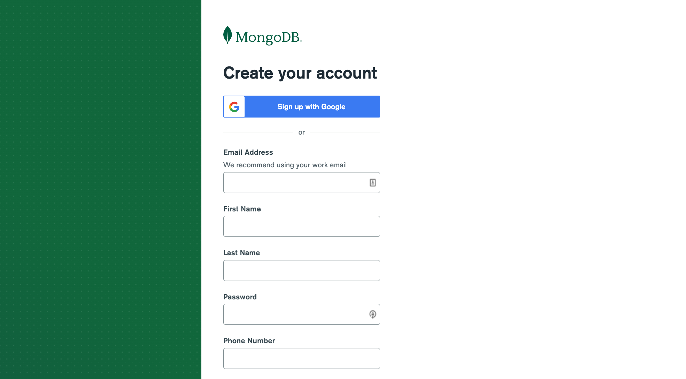
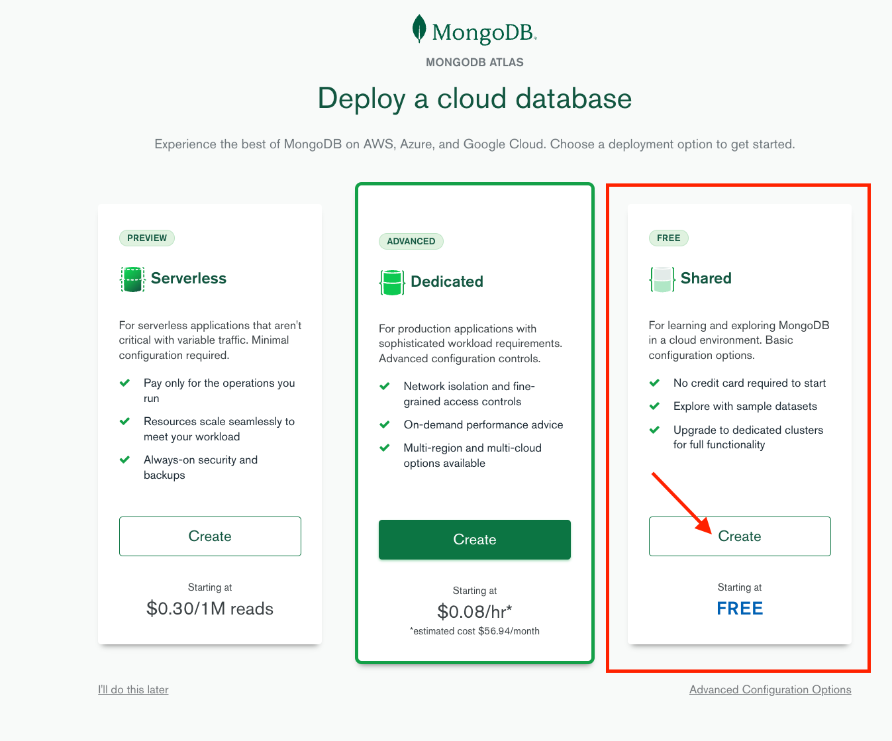
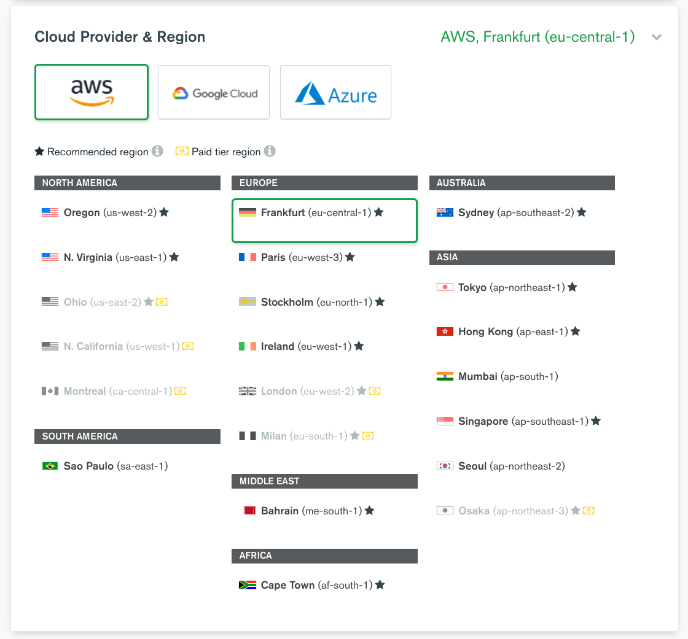
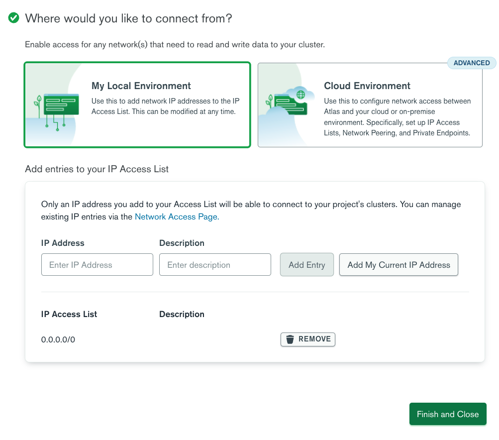
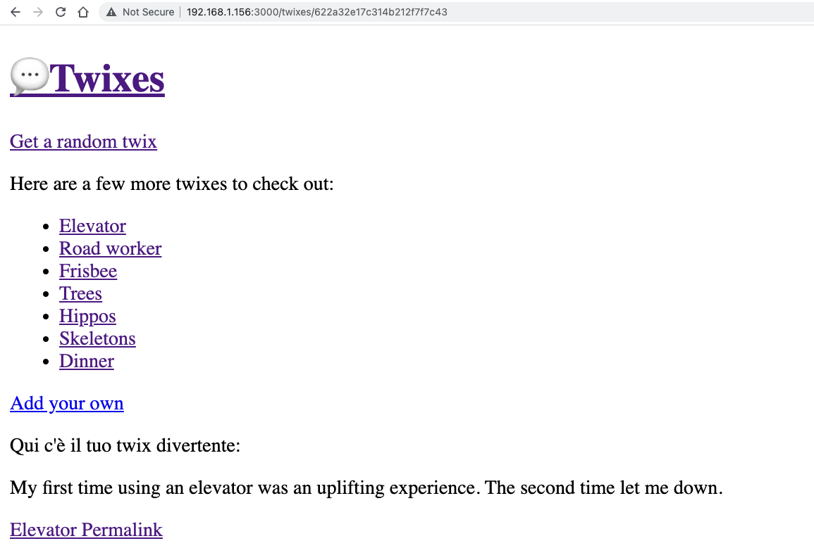

# Database (MongoDB)

| Capitolo precedente  | Capitolo successivo     |
| :--------------- | ---------------: |
| [◀︎ 03-struttura-routes](../03-struttura-routes)| [05-mutations ▶︎](../05-mutations) |


## Setup MongoDB

Utilizzeremo Prisma con funzionalità sperimentali per la connessione a un database MongoDB per salvare i nostri twix.

La maggior parte delle applicazioni reali richiede una qualche forma di persistenza dei dati. Nel nostro caso, vogliamo salvare i nostri twix su un database in modo che le persone possano leggere i nostri twix e persino inviare i propri (come vedrai nella sezione di autenticazione!).

## Set up Prisma

Il team di Prisma ha creato [un'estensione VSCode](https://marketplace.visualstudio.com/items?itemName=Prisma.prisma) che potresti trovare molto utile quando lavori su Prisma.

Andrai ad usare il database [MongoDB](https://www.mongodb.com/)
attraverso [Prisma](https://www.prisma.io) che è una libreria che ti permette di interagire con i database con comandi più semplici ed intuitivi. 

È un ottimo punto di partenza se non sei sicura di quale database utilizzare.

Ci sono due pacchetti di cui abbiamo bisogno per iniziare con cui espandere le funzionalità di Remix:

- `prisma` per interagire con il nostro database e schema durante lo sviluppo
- `@prisma/client` per effettuare query al nostro database durante il runtime.

💿 Installa i pacchetti prisma:

```sh
npm install --save-dev prisma
npm install @prisma/client
```
<details>

<summary>Focus: salvataggio pacchetti</summary>

Per salvare i pacchetti, il comando è `npm install nomepacchetto`. I pacchetti possono essere installati in modo che vengano usati sia nell'app in versione finale e costruita che in sviluppo oppure solo in sviluppo. Per dire che quel pacchetto lo vogliamo solo per lo sviluppo, al comando dobbiamo aggiungere `--save-dev` prima del nome del pacchetto, dunque `npm install --save-dev nomepacchetto`

</details>

💿 Invochiamo Prisma per verificare che si sia installato correttamente tramite il comando:

```sh
npx prisma
```

💿 Ora possiamo inizializzare Prisma che creerà la nostra cartella Prisma

```sh
npx prisma init
```

Ti darà questo output:

```
✔ Your Prisma schema was created at prisma/schema.prisma
  You can now open it in your favorite editor.

warn You already have a .gitignore. Don't forget to exclude .env to not commit any secret.

Next steps:
1. Set the DATABASE_URL in the .env file to point to your existing database. If your database has no tables yet, read https://pris.ly/d/getting-started
2. Set the provider of the datasource block in schema.prisma to match your database: postgresql, mysql, sqlite, sqlserver or mongodb (Preview).
3. Run prisma db pull to turn your database schema into a Prisma schema.
4. Run prisma generate to generate the Prisma Client. You can then start querying your database.

More information in our documentation:
https://pris.ly/d/getting-started
```

## MongoDB

Utilizzeremo il Free Shared DB, è gratuito, non è richiesta la carta di credito per iniziare e puoi sfruttare la potenza del database cloud.

1. Vai su <https://account.mongodb.com/account/register?tck=docs_atlas> e crea un account (puoi usare il Sign di Google o creare un account)
  
2. Scegli il `Free Shared` account
  
3. Scegli il cluster geograficamente più vicino a te e crea il cluster.
  
4. In `Security QuickStart`, crea un autenticazione `Username and Password`. Salva queste informazioni perché ne avremo presto bisogno. Crea un utente ad esempio remix_user con una password sicura.
  

Per l'elenco di accesso IP, inseriremo 0.0.0.0 come IP per garantire che il nostro database sia attivo e funzionante rapidamente per lo sviluppo. Ti consigliamo di limitare gli IP per le app di produzione.



6. Sarai ridirezionata a `Database Deployments` che mostrerà `Cluster0`.
7. Clicca il pulsante `Connect` vicino `Cluster 0`
8. Clicca `Connect your application`
9. Copia la stringa di connessione fornita.
10. Nella tua app Remix, cerca il file `.env` nella cartella root, quella principale. Questo è un file di ambiente locale in cui memorizzeremo le informazioni dell'URL Mongo contenente nome utente e password per il tuo database. Aprendo il file `.env` vedrai che Prisma ha già inserito alcune informazioni, tra cui un `DATABASE_URL`.
11. Aggiorniamo il `DATABASE_URL` in modo che sia il nostro nuovo indirizzo del server.

```
DATABASE_URL="mongodb+srv://nomeutente:<password>@twixel.ycwht.mongodb.net/myFirstDatabase?retryWrites=true&w=majority"
```

Sostituisci il `nomeutente` con il nome utente che hai creato, la `<password>` con la password creata e `myFirstDatabase` con il nome del database che hai appena creato (`Cluster0`)

<details>

<summary>Focus: i file .env</summary>

Un'applicazione, per funzionare, può avere bisogno di informazioni i cui valori cambiano da caso a caso ma che ne costituiscono parti fondamentali per il suo funzionamento. Sono parte del suo ambiente, il suo `environment` - da qui il file `.env`. In questo file, con dei nommi univoci possiamo salvare queste variabili per utilizzarle attrvaerso tutta l'app, senza ogni volta riscriverle a mano.

</details>

## Fai il setup di Prisma

Ora che hai inizializzato prisma, potrai iniziare a modellare i dati dell'app. Poiché questo non è un tutorial sui Prisma, te li daremo già pronti ora ma puoi leggere di più sullo schema dei prisma dai [loro documenti](https://www.prisma.io/docs/reference/api-reference/prisma-schema-reference) nel caso ti interessi approfondire.

Copia e incolla i seguenti dati all'interno del file `schema.prisma` che trovi dentro la cartella `prisma`:

```prisma filename=prisma/schema.prisma lines=[13-19]
// This is your Prisma schema file,
// learn more about it in the docs: https://pris.ly/d/prisma-schema

generator client {
  provider = "prisma-client-js"
  previewFeatures = ["mongoDb"]
}

datasource db {
  provider = "mongodb"
  url      = env("DATABASE_URL")
}

model Twix {
  id       String @id @default(auto()) @map("_id") @db.ObjectId
  createdAt  DateTime @db.Date @default(now())
  updatedAt  DateTime @db.Date @default(now())
  title       String
  content    String
}
```

💿 Fatto ciò esegui questo comando nel terminale:

```sh
npx prisma db push
```

> Se hai dei problemi controlla di aver inserito correttamente la variabile `DATABASE_URL="mongodb+srv://nomeutente:<password>@twixel.ycwht.mongodb.net/myFirstDatabase?retryWrites=true&w=majority"`, deve essere senza `<` e `>` nella password e senza spazi.

Questo comando ti darà questo output:

```sh
Environment variables loaded from .env
Prisma schema loaded from prisma/schema.prisma
Datasource "db"

🚀  Your database is now in sync with your schema. Done in 194ms

✔ Generated Prisma Client (3.10.0 | library) to ./node_modules/@prisma/client in 167ms
```

Questo comando ha fatto alcune cose. Ha inviato tutte le modifiche necessarie al nostro database in modo che corrisponda allo schema che abbiamo fornito. Alla fine ha generato i tipi TypeScript di Prisma - in questo modo otterai un completamento automatico e un controllo stellari della correttezza dei tipi di dati e oggetti che scriverai nel codice mentre utilizzerai le API di Prisma per interagire con il tuo database.

## Crea i primi Twix in massa

💿 Copia questo in un nuovo file chiamato `seed.ts` dentro la cartella `prisma` per avere una prima lista di Twix scritti a mano da noi:

```ts filename=prisma/seed.ts
import { PrismaClient } from "@prisma/client";
const db = new PrismaClient();

async function seed() {
  await Promise.all(
    getTwixes().map((twix) => {
      return db.twix.create({ data: twix });
    })
  );
}

seed();

function getTwixes() {
  // shout-out to https://icanhazdadjoke.com/

  return [
    {
      title: "Road worker",
      content: `I never wanted to believe that my Dad was stealing from his job as a road worker. But when I got home, all the signs were there.`,
      
    },
    {
      title: "Frisbee",
      content: `I was wondering why the frisbee was getting bigger, then it hit me.`,
    },
    {
      title: "Trees",
      content: `Why do trees seem suspicious on sunny days? Dunno, they're just a bit shady.`,
    },
    {
      title: "Skeletons",
      content: `Why don't skeletons ride roller coasters? They don't have the stomach for it.`,
    },
    {
      title: "Hippos",
      content: `Why don't you find hippopotamuses hiding in trees? They're really good at it.`,
    },
    {
      title: "Dinner",
      content: `What did one plate say to the other plate? Dinner is on me!`,
    },
    {
      title: "Elevator",
      content: `My first time using an elevator was an uplifting experience. The second time let me down.`,
    },
  ];
}

```


Sentiti libera di aggiungere tutti i twix che vuoi.

Ora dobbiamo solo eseguire questo file. L'abbiamo scritto in TypeScript per assicurarci di usare i tipi corretti (questo è molto più utile quando l'app e i modelli di dati crescono in complessità). Quindi avremo bisogno di un modo per eseguirlo.

<details>

<summary>Focus: Typescript</summary>

Javascript è un linguaggio di progammazione che aggiunge ai siti web interattività e funzionalità, a esempio salvare un post quando clicchi un bottone oppure ricaricare una pagina quando fai pull-to-refresh.

Typescript è simile a Javascript, ma aggiunge un livello di controllo ulteriore per facilitare la scrittura di app grandi e complesse. Quando scrivi una app web, può capitare di fare uso di tanti tipi di oggetti con caratteristiche differenti. A esempio. l'oggetto `libro` è fatto da un totale di pagine, che è un `numero` e da un testo, che è una `stringa`. Inserire una stringa nel numero totale di pagine potrebbe portare a bug imprevisti. Con Typpescript definisci a priori tutti i tipi e i modelli di dati che usi, in modo da avere controlli automatici che effettivamente i valori che stai usando siano sempre quelli corretti per l'oggetto in uso.

</details>

## Gestione Typescript

💿 Installa `esbuild-register` come dipendenza di sviluppo:

```sh
npm install --save-dev esbuild-register
```

💿 E ora possiamo eseguire il nostro file `seed.ts` con quello:

```sh
node --require esbuild-register prisma/seed.ts
```

Ora il tuo database ha dei twix dentro!

Ma non vorrai ricordarti di eseguire quello script ogni volta che resetti il database. Fortunatamente, non ti servirà!

💿 Aggiungi questo codice al tuo `package.json`:

```json nocopy
// ...
  "prisma": {
    "seed": "node --require esbuild-register prisma/seed.ts"
  },
  "scripts": {
// ...
```

Ora, ogni volta che ripristinerai il database, Prisma chiamerà anche il file di seeding.

## Focus: il package.json

Il file `package.json` contiene la lista di tutti i pacchetti che hai installato (a esempio `prisma` poco fa) ma anche delle azioni da far fare quando esegui certi comandi, come `npm run dev`.

## Connettiti al database

Fino a qui abbiamo messo in piedi il database, ma il problema è che ora, durante lo sviluppo, dobbiamo chiudere e riavviare completamente il server ogni volta che apportiamo una modifica sul server, dato che `@remix-run/serve` ricostruisce effettivamente il nostro codice e lo richiede nuovo di zecca. 

Il problema qui è che ogni volta che apportiamo una modifica al codice, stabiliremo una nuova connessione al database e alla fine esauriremo le connessioni totali a disposizione del nostro piano free! Questo è un problema così comune con le app di accesso al database che Prisma ha un avviso per questo:

> Warning: 10 Prisma Clients are already running

Quindi abbiamo un po' di lavoro in più da fare per evitare questo problema in sviluppo.

Nota che questo non è un problema solo di Remix ma anche di altri framework. Ogni volta che hai un "ricaricamento in tempo reale" del codice del server, dovrai o disconnetterti e riconnetterti ai database (che può essere lento) o eseguire la soluzione alternativa qui sotto.

💿 Copia il codice in un nuovo file chiamato `app/utils/db.server.ts`:

```ts filename=app/utils/db.server.ts
import { PrismaClient } from "@prisma/client";

let db: PrismaClient;

declare global {
  var __db: PrismaClient | undefined;
}

// this is needed because in development we don't want to restart
// the server with every change, but we want to make sure we don't
// create a new connection to the DB with every change either.
if (process.env.NODE_ENV === "production") {
  db = new PrismaClient();
  db.$connect();
} else {
  if (!global.__db) {
    global.__db = new PrismaClient();
    global.__db.$connect();
  }
  db = global.__db;
}

export { db };
```

Ti lasciamo l'analisi di questo codice come esercizio perché, ancora una volta, questo non ha nulla a che fare direttamente con Remix.

L'unica cosa che ti facciamo notare è la convenzione del nome del file. La parte `.server` del nome del file informa Remix che questo codice non dovrebbe mai finire nel browser. 

Questo passaggio facoltativo, perché Remix fa già un ottimo lavoro nel garantire che il codice del server non finisca nel client. Ma a volte alcune dipendenze del solo server sono difficili da eliminare, quindi l'aggiunta di `.server` al nome del file è un suggerimento per il compilatore di non preoccuparsi di questo modulo o delle sue importazioni durante l'impacchettamento (bundling) per il browser. Il `.server` agisce come una sorta di confine per il compilatore.

## Leggi dal database in un loader di Remix

Ok, pronta per tornare a scrivere il codice Remix e della nostra app?

Il nostro obiettivo è mettere un elenco di twixes sul percorso `twixes.tsx` in modo da poter avere un elenco di link a twix tra cui le persone possono scegliere. In Remix, ogni route module (ovvero le pagine che abbiamo creato nella lezione 03, a esempio `twixes.tsx` stessa) è responsabile dell'acquisizione dei propri dati. Quindi, se vogliamo dati sul percorso `/twixes`, aggiorneremo il file `app/routes/twixes.tsx`.

Per *_caricare_* i dati in un route module di Remix, si usa un [**`loader`**](https://remix.run/docs/en/v1.3.2-pre.0/api/conventions#loader). Il **`loader`** è una funzione `async` che esportiamo e che restituisce una risposta a cui accediamo da dentor il nostro **`HTML`** tramite l'hook [`useLoaderData`](https://remix.run/docs/en/v1.3.2-pre.0/api/remix#useloaderdata). Ecco un rapido esempio:

```tsx nocopy
// questo è un esempio. Non serve copiarlo 😄
import type { LoaderFunction } from "remix";
import type { User } from "@prisma/client";

import { db } from "~/utils/db.server";

type LoaderData = { 
  users: Array<User> 
};

export let loader: LoaderFunction = async () => {
  const data: LoaderData = {
    users: await db.user.findMany(),
  };
  return data;
};

export default function Users() {
  const data = useLoaderData<LoaderData>();
  return (
    <ul>
      {data.users.map((user) => (
        <li key={user.id}>{user.name}</li>
      ))}
    </ul>
  );
}
```

Remix e il file `tsconfig.json` che vengono creati in automatico vengono configurati in modo da permettere di importare tutti i file della cartella `app/` utilizzando la shortcut `~` (lo puoi vedere sopra per l'import delle utils). Questo ti permette di non dover importare i file scrivendo l'intero percorso `../../`.

💿 Aggiorna il file `app/routes/twixes.tsx` in modo da caricare tutti i twixes dal nostro database e renderizzare una lista di collegamenti ai nostri twix.

<details>

<summary>app/routes/twixes.tsx</summary>

```tsx filename=app/routes/twixes.tsx lines=[1-2,4,11-13,15-20,23,47-51]
import type { LinksFunction, LoaderFunction } from "remix";
import { Link, Outlet, useLoaderData } from "remix";

import { db } from "~/utils/db.server";

type LoaderData = {
  twixListItems: Array<{ id: string; title: string }>;
};

export const loader: LoaderFunction = async () => {
  const data: LoaderData = {
    twixListItems: await db.twix.findMany(),
  };
  return data;
};

export default function TwixesRoute() {
  const data = useLoaderData<LoaderData>();

  return (
    <div className="twixes-layout">
      <header className="twixes-header">
        <div className="container">
          <h1 className="home-link">
            <Link
              to="/"
              title="Remix twixes"
              aria-label="Remix twixes"
            >
              <span className="logo">💬</span>
              <span className="logo-medium">Twixes</span>
            </Link>
          </h1>
        </div>
      </header>
      <main className="twixes-main">
        <div className="container">
          <div className="twixes-list">
            <Link to=".">Get a random twix</Link>
            <p>Here are a few more twixes to check out:</p>
            <ul>
              {data.twixListItems.map((twix) => (
                <li key={twix.id}>
                  <Link to={twix.id}>{twix.title}</Link>
                </li>
              ))}
            </ul>
            <Link to="new" className="button">
              Add your own
            </Link>
          </div>
          <div className="twixes-outlet">
            <Outlet />
          </div>
        </div>
      </main>
    </div>
  );
}
```

</details>

Ora dovresti vedere questo:


## Scaricare solo il necessario

Vediamo in dettaglio una parte della soluzione proposta:

```tsx lines=[8-10]
type LoaderData = {
  twixListItems: Array<{ id: string; title: string }>;
};

export const loader: LoaderFunction = async () => {
  const data: LoaderData = {
    twixListItems: await db.twix.findMany({
      take: 5,
      select: { id: true, title: true },
      orderBy: { createdAt: "desc" },
    }),
  };
  return data;
};
```

Puoi notare che tutto quello che ci serve per questa pagina sono solamente l'`id` e il `title` di un twix. Non c'è bisogno di scaricare dal database anche il contenuto di ogni twix. Inoltre per non scaricare ogni volta dal database tutti i twix, andiamo a chiedere gli ultimi 5 twix ordinati per data di creazione, in modo da avere gli ultimi twix scritti. 

In tutto questo ci aiuta `prisma`, perché ci permette di richiedere al nostro database solamente quello che ci serve, evitando di mandare al client più dati del necessario. Tutte queste accortezze permettono di avere un'app più veloce e responsiva per chi la utilizza. E puoi farlo anche avendo altri tipi di database o client, non ti serve necessariamente Prisma o l'accesso diretto ad un database: puoi adottare queste tecniche e mandare al client solo i dati che servono anche usando ad esempio GraphQL CLient o delle REST APIs, ti basta filtrare i dati extra prima di mandarli al loader!

## Wrap up database queries

Prima di occuparci dell'url `/twixes/:twixId`, ovvero la visualizzazione in dettaglio di un singolo Twix, ti lasciamo un piccolo esempio di come puoi avere accesso ai parametri (come ad esempio il `:twixId` dell'url):

```tsx nocopy
export const loader: LoaderFunction = async ({
  params,
}) => {
  console.log(params); // <-- {twixId: "123"}
};
```

E così è come puoi usare l'id del twix per chidere a Prisma e al database i dati del twix:

```tsx nocopy
const twix = await db.twix.findUnique({
  where: { id: twixId },
});
```

> Ricorda che quando facciamo riferimento agli url diremo `/twixes/:twixId`, mentre quando faremo riferimento al file all'interno del progetto diremo `/app/routes/twixes/$twixId.tsx`

💿 Ottimo! Ora possiamo lavorare sull'url `/twixes/:twixId` nel file `app/routes/twixes/$twixId.tsx`.

<details>

<summary>app/routes/twixes/$twixId.tsx</summary>

```tsx filename=app/routes/twixes/$twixId.tsx lines=[3,5,7,9-18,21]
import type { LoaderFunction } from "remix";
import { Link, useLoaderData } from "remix";
import type { Twix } from "@prisma/client";

import { db } from "~/utils/db.server";

type LoaderData = { twix: Twix };

export const loader: LoaderFunction = async ({
  params,
}) => {
  const twix = await db.twix.findUnique({
    where: { id: params.twixId },
  });
  if (!twix) throw new Error("Twix not found");
  const data: LoaderData = { twix };
  return data;
};

export default function TwixRoute() {
  const data = useLoaderData<LoaderData>();

  return (
    <div>
      <p>Qui c'è il tuo twix divertente:</p>
      <p>{data.twix.content}</p>
      <Link to=".">{data.twix.title} Permalink</Link>
    </div>
  );
}
```

</details>

Ora dovresti essere in grado di andare all'url [`/twixes`](http://localhost:3000/twixes) e cliccando su un link, puoi ottenere il link al twix:



Gestiremo il caso in cui un utente prova ad accedere ad una pagina di un twix inestistente, nei prossimi capitoli.

Ora gestiamo la pagina `/twixes` nel file `app/routes/twixes/index.tsx` che mostra un twix randomico.

Questo è il modo per ottenere un twix random con Prisma:

```tsx
const count = await db.twix.count();
const randomRowNumber = Math.floor(Math.random() * count);
const [randomTwix] = await db.twix.findMany({
  take: 1,
  skip: randomRowNumber,
});
```

💿 Qui puoi vedere come modificare il file:

<details>

<summary>app/routes/twixes/index.tsx</summary>

```tsx filename=app/routes/twixes/index.tsx lines=[3,5,7,9-18,21]
import type { LoaderFunction } from "remix";
import { useLoaderData, Link } from "remix";
import type { Twix } from "@prisma/client";

import { db } from "~/utils/db.server";

type LoaderData = { randomTwix: Twix };

export const loader: LoaderFunction = async () => {
  const count = await db.twix.count();
  const randomRowNumber = Math.floor(Math.random() * count);
  const [randomTwix] = await db.twix.findMany({
    take: 1,
    skip: randomRowNumber,
  });
  const data: LoaderData = { randomTwix };
  return data;
};

export default function TwixesIndexRoute() {
  const data = useLoaderData<LoaderData>();

  return (
    <div>
      <p>Here's a random twix:</p>
      <p>{data.randomTwix.content}</p>
      <Link to={data.randomTwix.id}>
        "{data.randomTwix.title}" Permalink
      </Link>
    </div>
  );
}
```

</details>

Adesso puoi andare su [`/twixes`](http://localhost:3000/twixes) e vedrai una lista di link a dei twix, con un intero twix random visualizzato assieme al suo contenuto:


| Capitolo precedente  | Capitolo successivo     |
| :--------------- | ---------------: |
| [◀︎ 03-struttura-routes](../03-struttura-routes)| [05-mutations ▶︎](../05-mutations) |
