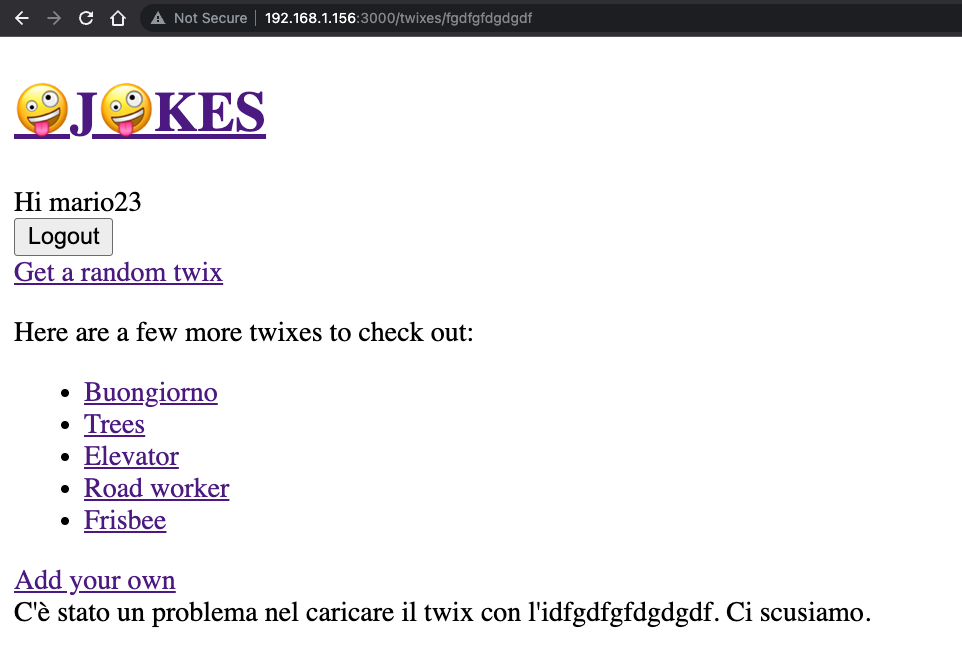

## Errori inaspettati

| Capitolo precedente  | Capitolo successivo     |
| :--------------- | ---------------: |
| [◀︎ 06-authentication](../06-authentication)| [08-expected-errors ▶︎](../08-expected-errors) |

Ci spiace dirlo, ma non sempre gli errori di un'applicazione sono evitabili (es. il server smette di rispondere). Quindi dobbiamo accettare la possibilità di avere degli errori inaspettati e dobbiamo cercare di gestirli.

Fortunatamente la gestione degli errori in Remix è ottima! Se hai usato in passato React, dovrebbe esserti familiare la funzionalità degli [Error Boundary feature](https://reactjs.org/docs/error-boundaries.html#gatsby-focus-wrapper). Con Remix, puoi esportare nelle fare pagine un componente[`ErrorBoundary`](../api/conventions#errorboundary) che funziona anche lato server. Inoltre puoi gestire gli errori sia nei `loader` che nelle `action`!

Un `Error Boundary` è una funzione che vive sullo stesso livello dei `loader` e delle `action` e intercetta tutti gli errori emessi dalla pagina, visualizza un messaggio di errore di conseguenza. Anche qui possiamo usare codice HTML per stilare il messaggio di errore e ci basterà gestire bene gli errori nei `loader` e nelle `action` per visualizzarlo.

Quello che ora andremo a fare sarà aggiungere `4` `Error Boundaries` alla nostra applicazione. Ne inseriremo uno in ogni pagina "figlia" di `app/routes/twixes/*` per gestire errori legati ai twixes e uno nel file `app/root.tsx` per gestire tutti gli altri errori inaspettati.

> L'ErrorBoundary del file `app/root.tsx` sarà quello un po' più complicato.

Ricorda che il file `app/root.tsx` è responsabile di renderizzare tutto l'`<html>` . Quando viene renderizzato un `ErrorBoundary`, questo viene renderizzato al posto di ciò che è esportato di default.

💿 Aggiungi un semplice ErrorBoundary ad ognuno dei seguenti file.

<details>

<summary>app/root.tsx</summary>

```tsx filename=app/root.tsx lines=[57-67]
import type { LinksFunction } from "remix";
import { Links, LiveReload, Outlet } from "remix";

function Document({
  children,
  title = `Remix: So great, it's funny!`,
}: {
  children: React.ReactNode;
  title?: string;
}) {
  return (
    <html lang="en">
      <head>
        <meta charSet="utf-8" />
        <title>{title}</title>
        <Links />
      </head>
      <body>
        {children}
        <LiveReload />
      </body>
    </html>
  );
}

export default function App() {
  return (
    <Document>
      <Outlet />
    </Document>
  );
}

export function ErrorBoundary({ error }: { error: Error }) {
  return (
    <Document title="Uh-oh!">
      <div>
        <h1>App Error</h1>
        <pre>{error.message}</pre>
      </div>
    </Document>
  );
}
```

</details>

<details>

<summary>app/routes/twixes/$twixId.tsx</summary>

```tsx filename=app/routes/twixes/$twixId.tsx nocopy
// ...

import { Link, useLoaderData, useParams } from "remix";

// ...

export function ErrorBoundary() {
  const { twixId } = useParams();
  return (
    <div>{`C'è stato un problema nel caricare il twix con l'id ${twixId}. Ci scusiamo.`}</div>
  );
}
```

</details>

<details>

<summary>app/routes/twixes/new.tsx</summary>

```tsx filename=app/routes/twixes/new.tsx nocopy
// ...

export function ErrorBoundary() {
  return (
    <div>
      Qualcosa è andato storto, ci scusiamo.
    </div>
  );
}
```

</details>

<details>

<summary>app/routes/twixes/index.tsx</summary>

```tsx filename=app/routes/twixes/index.tsx nocopy
// ...

export function ErrorBoundary() {
  return (
    <div>
      Ooops! C'è stato un problema
    </div>
  );
}
```

</details>

Ottimo, ora che hai inserito tutti e 4 gli `ErrorBoundary` vediamo cosa succede quando c'è un errore. Prova ad aprire un dettaglio di un Twix, poi nella barra di ricerca metti dei caratteri a caso al posto dell'id e premi invio. Dovresti vedere il messaggio di errore raccolto dall'`ErrorBoundary`:



La cosa fantastica di aver gestito gli errori nelle singole parti, è che se ci sono degli errori solo le parti che hanno un errore sono inutilizzabili mentre il resto dell'applicazione rimane interattiva. Questo è un'ottima cosa, perché solitamente nelle applicazione se c'è un errore tutta l'applicazione si blocca.

| Capitolo precedente  | Capitolo successivo     |
| :--------------- | ---------------: |
| [◀︎ 06-authentication](../06-authentication)| [08-expected-errors ▶︎](../08-expected-errors) |