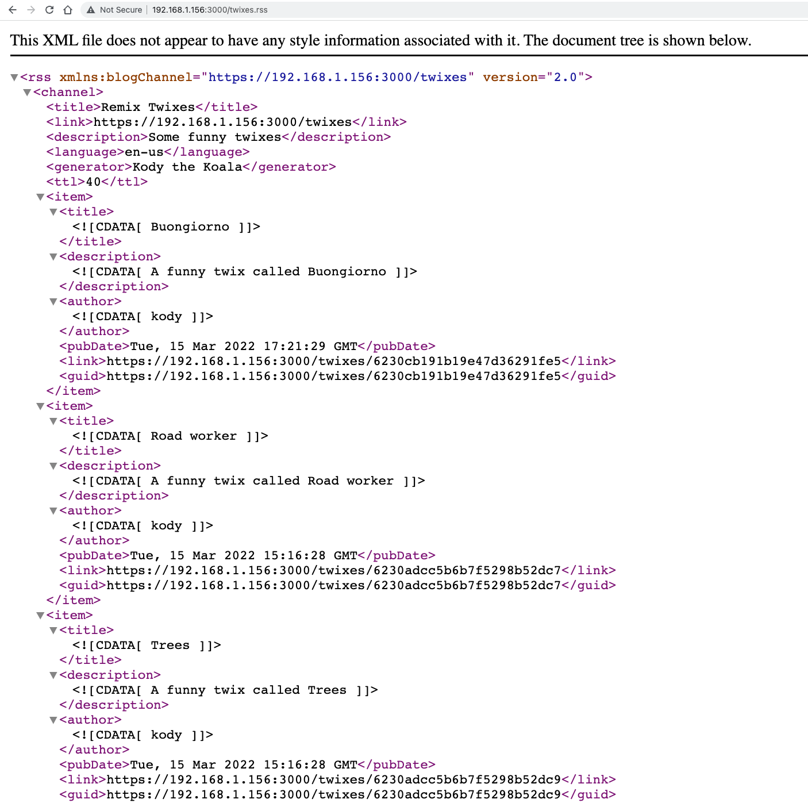

## Pagine con risorse

| Capitolo precedente  | Capitolo successivo     |
| :--------------- | ---------------: |
| [◀︎ 09-seo](../09-seo)| [11-javascript ▶︎](../11-javascript) |


A volte vogliamo che le nostre pagine visualizzino qualcosa di diverso da un documento HTML. A esempio, forse hai un URL che genera la tua immagine social per un post del blog, o l'immagine per un prodotto, o i dati CSV per un report, o un feed RSS, o una sitemap del sito, o forse vuoi implementare un'API per la tua app mobile o qualsiasi altra cosa.

Ecco a cosa servono le [Resource Routes](../guides/resource-routes). Sarebbe top avere un feed RSS di tutti i nostri twix, magari all'URL `/twixes.rss`. Ma affinché funzioni, dovrai trattare il punto `.` in modo particolare perchè venga riconosciuto come tale perché quel carattere ha un significato speciale nei nomi dei file di percorso Remix. Puoi leggere di più sull'[escaping dei caratteri speciali qui](../api/conventions#escaping-special-characters).

<docs-info>Che tu ci creda o no, in realtà ne hai già fatta una. Controlla la pagina di logout! Nessuna interfaccia utente è necessaria perché è lì solo per gestire le mutazioni e reindirizzare le anime perse.</docs-info>

Per questo, probabilmente vorrai almeno dare un'occhiata all'esempio a meno che tu non voglia leggere le specifiche RSS 😅.

💿 Crea una pagina `/twixes.rss`.

<details>

<summary>app/routes/twixes[.]rss.tsx</summary>

```tsx filename=app/routes/twixes[.]rss.tsx
import type { LoaderFunction } from "remix";

import { db } from "~/utils/db.server";

function escapeCdata(s: string) {
  return s.replace(/\]\]>/g, "]]]]><![CDATA[>");
}

function escapeHtml(s: string) {
  return s
    .replace(/&/g, "&amp;")
    .replace(/</g, "&lt;")
    .replace(/>/g, "&gt;")
    .replace(/"/g, "&quot;")
    .replace(/'/g, "&#039;");
}

export const loader: LoaderFunction = async ({
  request,
}) => {
  const twixes = await db.twix.findMany({
    take: 100,
    orderBy: { createdAt: "desc" },
    include: { twixester: { select: { username: true } } },
  });

  const host =
    request.headers.get("X-Forwarded-Host") ??
    request.headers.get("host");
  if (!host) {
    throw new Error("Could not determine domain URL.");
  }
  const protocol = host.includes("localhost")
    ? "http"
    : "https";
  const domain = `${protocol}://${host}`;
  const twixesUrl = `${domain}/twixes`;

  const rssString = `
    <rss xmlns:blogChannel="${twixesUrl}" version="2.0">
      <channel>
        <title>Remix Twixes</title>
        <link>${twixesUrl}</link>
        <description>Some funny twixes</description>
        <language>en-us</language>
        <generator>Kody the Koala</generator>
        <ttl>40</ttl>
        ${twixes
          .map((twix) =>
            `
            <item>
              <title><![CDATA[${escapeCdata(
                twix.title
              )}]]></title>
              <description><![CDATA[A funny twix called ${escapeHtml(
                twix.title
              )}]]></description>
              <author><![CDATA[${escapeCdata(
                twix.twixester.username
              )}]]></author>
              <pubDate>${twix.createdAt.toUTCString()}</pubDate>
              <link>${twixesUrl}/${twix.id}</link>
              <guid>${twixesUrl}/${twix.id}</guid>
            </item>
          `.trim()
          )
          .join("\n")}
      </channel>
    </rss>
  `.trim();

  return new Response(rssString, {
    headers: {
      "Cache-Control": `public, max-age=${
        60 * 10
      }, s-maxage=${60 * 60 * 24}`,
      "Content-Type": "application/xml",
      "Content-Length": String(
        Buffer.byteLength(rssString)
      ),
    },
  });
};
```

</details>



Puoi seriamente fare qualsiasi cosa tu possa immaginare con questa API! Se lo desideri, potresti persino creare un'API JSON per una versione nativa della tua app - hai a disposizione tanta potenza qui.

💿 Sentiti libera di mettere un link a quel feed RSS sulle pagine `app/routes/index.tsx` e `app/routes/twixes.tsx`. Nota che se usi `<Link />` vorrai usare il prop `reloadDocument` perché non puoi eseguire una transizione lato client a un URL che non fa tecnicamente parte dell'app React:

```
<Link to="twixes.rss" reloadDocument>Feed RSS</Link>
```

| Capitolo precedente  | Capitolo successivo     |
| :--------------- | ---------------: |
| [◀︎ 09-seo](../09-seo)| [11-javascript ▶︎](../11-javascript) |
