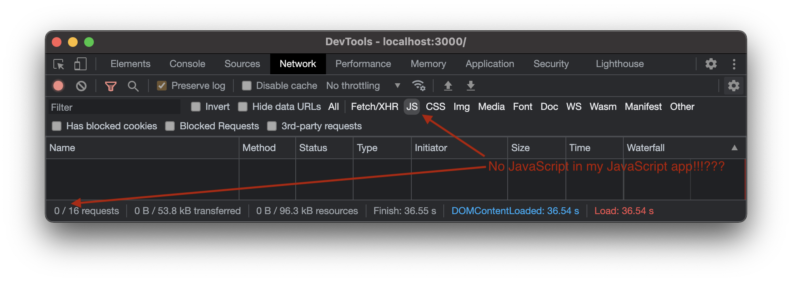
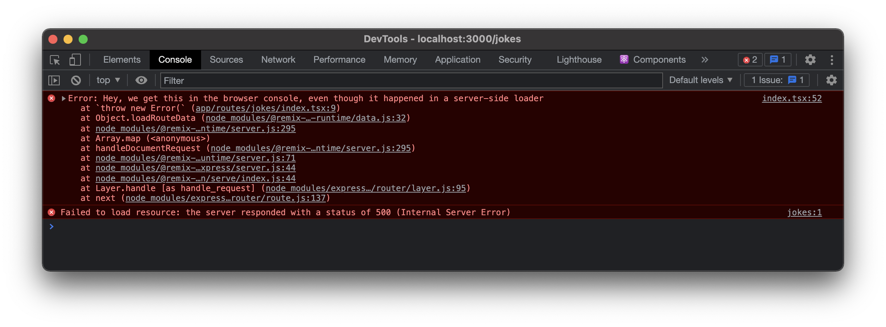

## JavaScript...

| Capitolo precedente  | Capitolo successivo     |
| :--------------- | ---------------: |
| [◀︎ 10-resource-routes](../10-resource-routes)| [12-optimistic-ui ▶︎](../12-optimistic-ui) |

Forse dovremmo effettivamente includere JavaScript nella nostra app JavaScript. 😂

Seriamente, vai alla tua app, tasto destro clicca `Ispeziona` e vai sulla tab `Network`.



Hai notato che la nostra app non caricava JavaScript prima d'ora? 😆 Questo in realtà è piuttosto significativo. La nostra intera app può funzionare senza JavaScript sulla pagina. Questo perché Remix sfrutta la piattaforma così bene per noi.

Perché è importante che la nostra app funzioni senza JavaScript? È perché siamo preoccupati per lo 0,002% di utenti che girano con JS disabilitato? Non proprio. È perché non tutti sono connessi alla tua app con una connessione velocissima e a volte JavaScript impiega del tempo per caricarsi o non riesce affatto a caricarsi. Rendere la tua app funzionante senza JavaScript significa che, quando ciò accade, la tua app _funziona ancora_ per i tuoi utenti anche prima che JavaScript termini il caricamento.

Un altro punto per l'esperienza dell'utente!

Ci sono ragioni per includere JavaScript nella pagina. Ad esempio, alcune esperienze UI comuni non possono essere accessibili senza JavaScript (la gestione del focus, quando ti muovi in una pagina con i tasti invece che con il cursore, in particolare non è eccezionale quando si hanno ricaricamenti a tutta pagina ovunque). E possiamo rendere l'esperienza utente ancora più piacevole con una UI ottimistica (in arrivo nel prossimo capitolo) quando abbiamo JavaScript sulla pagina. Ma abbiamo pensato che sarebbe bello mostrarti quanto lontano puoi arrivare con Remix senza JavaScript per i tuoi utenti con connessioni di rete scadenti. 💪

Ok, quindi carichiamo JavaScript su questa pagina ora 😆

💿 Usa il componente di Remix [`<Scripts />` component](../api/remix#meta-links-scripts) 
per caricare tutti i file JavaScript dentro `app/root.tsx`.

<details>

<summary>app/root.tsx</summary>

```tsx filename=app/root.tsx lines=[8,65,97]
import type { LinksFunction, MetaFunction } from "remix";
import {
  Links,
  LiveReload,
  Outlet,
  useCatch,
  Meta,
  Scripts,
} from "remix";

import globalStylesUrl from "./styles/global.css";
import globalMediumStylesUrl from "./styles/global-medium.css";
import globalLargeStylesUrl from "./styles/global-large.css";

export const links: LinksFunction = () => {
  return [
    {
      rel: "stylesheet",
      href: globalStylesUrl,
    },
    {
      rel: "stylesheet",
      href: globalMediumStylesUrl,
      media: "print, (min-width: 640px)",
    },
    {
      rel: "stylesheet",
      href: globalLargeStylesUrl,
      media: "screen and (min-width: 1024px)",
    },
  ];
};

export const meta: MetaFunction = () => {
  const description = `Learn Remix and laugh at the same time!`;
  return {
    description,
    keywords: "Remix,twixes",
    "twitter:image": "https://remix-twixes.lol/social.png",
    "twitter:card": "summary_large_image",
    "twitter:creator": "@remix_run",
    "twitter:site": "@remix_run",
    "twitter:title": "Remix Twixes",
    "twitter:description": description,
  };
};

function Document({
  children,
  title = `Remix: So great, it's funny!`,
}: {
  children: React.ReactNode;
  title?: string;
}) {
  return (
    <html lang="en">
      <head>
        <meta charSet="utf-8" />
        <Meta />
        <title>{title}</title>
        <Links />
      </head>
      <body>
        {children}
        <Scripts />
        <LiveReload />
      </body>
    </html>
  );
}

export default function App() {
  return (
    <Document>
      <Outlet />
    </Document>
  );
}

export function CatchBoundary() {
  const caught = useCatch();

  return (
    <Document
      title={`${caught.status} ${caught.statusText}`}
    >
      <div className="error-container">
        <h1>
          {caught.status} {caught.statusText}
        </h1>
      </div>
    </Document>
  );
}

export function ErrorBoundary({ error }: { error: Error }) {
  console.error(error);

  return (
    <Document title="Uh-oh!">
      <div className="error-container">
        <h1>App Error</h1>
        <pre>{error.message}</pre>
      </div>
    </Document>
  );
}
```

</details>


💿 Un'altra cosa che possiamo fare ora è che puoi accettare la prop `error` in tutti i tuoi componenti `ErrorBoundary` e `console.error(error);` e otterrai anche gli errori lato server loggati nella console del browser.



### Forms

Remix ha il suo componente [`<Form />`](../api/remix#form). Quando JavaScript non è ancora caricato, funziona allo stesso modo di un modulo normale, ma quando JavaScript è abilitato, viene "progressivamente migliorato" per fare invece una richiesta di "fetch" in modo da non ricaricare l'intera pagina.

💿 Trova tutti gli elementi `<form />` e cambiali nel componente Remix `<Form />`.

### Precaricare

Se un utente mette a fuoco o passa il mouse su un link, è probabile che voglia accedervi. Quindi possiamo precaricare la pagina a cui stanno andando. E questo è tutto ciò che serve per abilitarlo per un link specifico:

```
<Link prefetch="intent" to="somewhere/neat">Somewhere Neat</Link>
```

💿 Aggiungi `prefetch="intent"` alla lista di link di Twix in `app/routes/twixes.tsx`.

| Capitolo precedente  | Capitolo successivo     |
| :--------------- | ---------------: |
| [◀︎ 10-resource-routes](../10-resource-routes)| [12-optimistic-ui ▶︎](../12-optimistic-ui) |