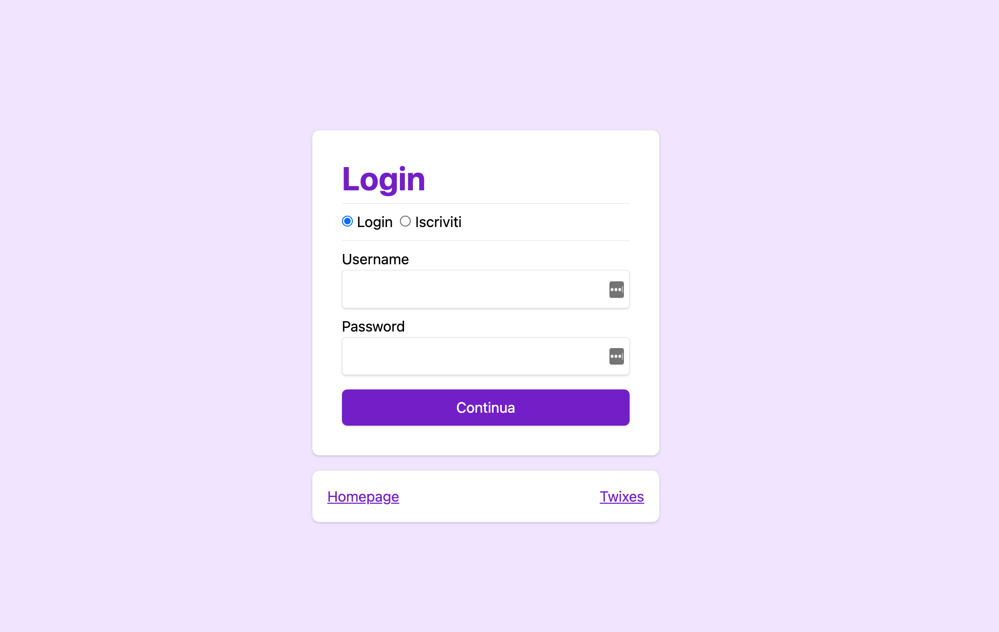
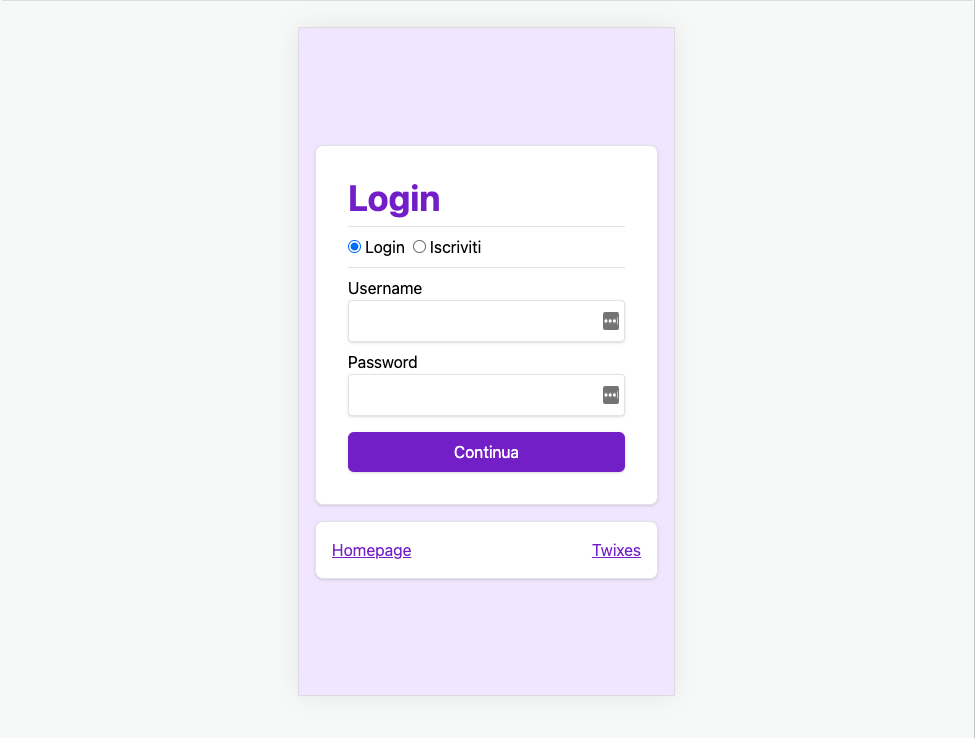
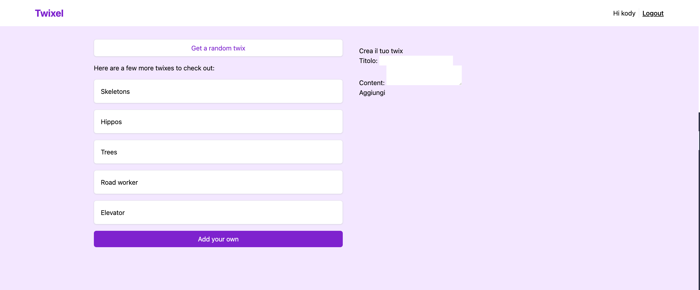
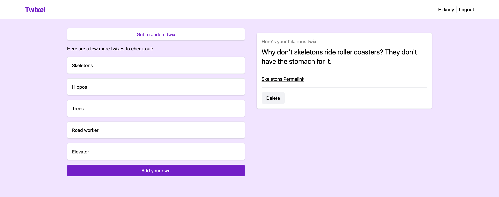
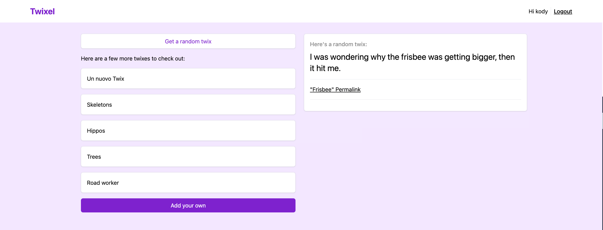
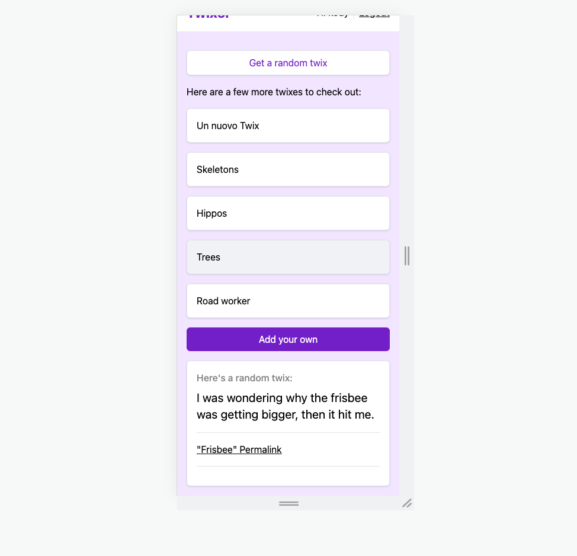

## Styling

| Capitolo precedente                                                  | Torna all'introduzione                                                        |
| :------------------------------------------------------------------- | ----------------------------------------------------------------------------: |
| [◀︎ ︎︎13-deployment](../13-deployment) | [Introduzione ▶︎](https://github.com/voxel-community/bootcamp-twixel/) |

Come hai potuto vedere, l'app che abbiamo messo online è piuttosto scarna visivamente - infatti, abbiamo usato solo il markup HTML puro. Ora, provvederemo ad aggiungere un po' di spice alle nostre interfacce con il CSS.

Il CSS è un linguaggio di programmazione che ci permette di modificare l'aspetto degli elementi HTML che abbiamo usato - possiamo cambiare dimensioni, colori, ombre, bordi, angoli, posizione e anche come si comportano quando il mouse ci passa sopra.

Alla base del CSS ci sono le classi: ogni classe è un contenitore di proprietà che andiamo a modificare. A esempio, guardiamo la classe scritta sotto:

```css
.rounded-red-square {
    border-radius: 16px;
    background-color: red;
    height: 200px;
    width: 200px;
}
```

Questa classe, quando viene applicata a un elemento HTML, lo rende alto e largo 200px (con le proprietà `height` e `width`), di colore rosso (il `background-color`) e con gli angoli smussati (`border-radius`).

Per l'app di Twixel, useremo l'approccio a classi ma in una maniera molto ottimizzata grazie a [TailwindCSS](https://tailwindcss.com/) 

## Installare TailwindCSS

Installa i pacchetti richiesti da Tailwind con il seguente comando: `npm install -d tailwindcss postcss autoprefixer nodemon`, poi installa il pacchetto `npm-run-all` con il comando `npm install npm-run-all`.

Dopo aver installato tutti i pacchetti, inizializza TailwindCSS con il comando `npx tailwindcss init -p` e nel file `tailwind.config.js` che si è creato nella root del progetto inserisci questo codice `content: ["./app/**/*.{ts,tsx,jsx,js}"],` così:

```js
module.exports = {
  content: ["./app/**/*.{ts,tsx,jsx,js}"],
  theme: {
    extend: {},
  },
  plugins: [],
}
```

Nel `package.json` copia-incolla questi `scripts`:

```json
"scripts": {
    "postinstall": "remix setup node",
    "dev": "cross-env NODE_ENV=development && run-p dev:*",
    "dev:remix": "cross-env NODE_ENV=development remix dev",
    "dev:css": "tailwindcss -w -i ./tailwind.css -o app/styles/tailwind.css",
    "build": "cross-env NODE_ENV=production run-p build:*",
    "build:remix": "cross-env NODE_ENV=production remix build",
    "build:css": "tailwindcss -m -i ./tailwind.css -o app/styles/tailwind.css",
    "start": "cross-env NODE_ENV=production remix-serve build"
  },
```

Crea un file `tailwind.css` nella root del progetto e inserisci: 

```css
@tailwind base;
@tailwind components;
@tailwind utilities;
```

Infine, aggiungi al `.gitignore` il file `app/styles/tailwind.css` e crea una cartella vuota `styles` all'interno della cartella `app`.

Siamo quasi pronti ad aggiungere lo stile al nostro codice - nel file `roots.tsx` aggiungi TailwindCSS nella funzione di `LinksFunciton` sopra alla `MetaFunction`

```tsx
//qui sopra ci sono altri import

import tailwind from "./styles/tailwind.css"

export const links: LinksFunction = () => {
  return [
    { rel: "stylesheet", href: tailwind }
  ];
};

// qui sotto c'è la MetaFunction
```

E ora facciamo partire l'app in sviluppo con `npm run dev` - già adesso possiamo vedere che il font dei testi è cambiato rispetto a prima. Dato che adesso stiamo usando TailwindCSS, gli stili di default del browser non vengono più applicati (come a esempio i link blu e sottolineati) ma viene usato Tailwind e dato che per ora non abbiamo aggiunto nessuna classe, viene solo applicato il font di default.

Ora procederemo ad aggiungere lo stile pagina per pagina. Partiremo dalla versione mobile e in alcuni casi aggiungeremo lo stile specifico per le versioni desktop, senza mai sdoppiare il codice dato che TailwindCSS rende questo passaggio immediato!

Per vedere come viene il sito web in mobile, clicca con il tasto destro, poi `Ispeziona` e nel pannello che si apre premi l'icona a forma di piccoli dispositivi per attivare la visualizzazione mobile.


## Pagina di login

Procediamo a modificare il codice HTML della pagina di login aggiungendo le classi. Qui sotto trovi tutto il codice che puoi copia-incollare, ma osserva i punti dove sono stati aggiunte le proprietà `className` con le classi di TailwindCSS.

Per aggiungere ogni tipo di classe, su RemixRun, come su React, bisogna aggiungerle all'interno della proprietà `className`.

<details>

<summary>app/routes/login.tsx</summary>

```html
<div className="w-screen h-screen bg-purple-100 flex flex-col items-center justify-center p-4">
      <div className="bg-white rounded-lg border shadow p-8 w-full max-w-sm" data-light="">
        <h1 className="text-4xl font-bold text-purple-700 mb-2">Login</h1>
        <Form method="post">
          <input
            type="hidden"
            name="redirectTo"
            value={
              searchParams.get("redirectTo") ?? undefined
            }
          />
          <fieldset className="py-2 border-t border-b mb-2">
            <legend className="sr-only">
              Login o Registrazione?
            </legend>
            <label>
              <input
                type="radio"
                name="loginType"
                value="login"
                defaultChecked={
                  !actionData?.fields?.loginType ||
                  actionData?.fields?.loginType === "login"
                }
              />{" "}
              Login
            </label>
            <label className="pl-2">
              <input
                type="radio"
                name="loginType"
                value="register"
                defaultChecked={
                  actionData?.fields?.loginType ===
                  "register"
                }
              />{" "}
              Iscriviti
            </label>
          </fieldset>
          <div>
            <label htmlFor="username-input">Username</label>
            <input
              type="text"
              id="username-input"
              name="username"
              defaultValue={actionData?.fields?.username}
              aria-invalid={Boolean(
                actionData?.fieldErrors?.username
              )}
              aria-errormessage={
                actionData?.fieldErrors?.username
                  ? "username-error"
                  : undefined
              }
              className="border shadow rounded w-full px-4 py-2 mb-2"
            />
            {actionData?.fieldErrors?.username ? (
              <p
                className="text-red-500 text-xs"
                role="alert"
                id="username-error"
              >
                {actionData.fieldErrors.username}
              </p>
            ) : null}
          </div>
          <div>
            <label htmlFor="password-input">Password</label>
            <input
              id="password-input"
              name="password"
              defaultValue={actionData?.fields?.password}
              type="password"
              aria-invalid={
                Boolean(
                  actionData?.fieldErrors?.password
                ) || undefined
              }
              aria-errormessage={
                actionData?.fieldErrors?.password
                  ? "password-error"
                  : undefined
              }
              className="border shadow rounded w-full px-4 py-2"
            />
            {actionData?.fieldErrors?.password ? (
              <p
              className="text-red-500 text-xs"
                role="alert"
                id="password-error"
              >
                {actionData.fieldErrors.password}
              </p>
            ) : null}
          </div>
          <div id="form-error-message">
            {actionData?.formError ? (
              <p
                className="text-red-500 text-xs"
                role="alert"
              >
                {actionData.formError}
              </p>
            ) : null}
          </div>
          <button type="submit" className="mt-4 bg-purple-700 rounded-md shadow px-3 py-2 w-full text-center text-white">
            Continua
          </button>
        </Form>
      </div>
      <div className="bg-white rounded-lg border shadow p-4 w-full max-w-sm mt-4">
        <ul className="flex items-center justify-between underline text-purple-700">
          <li>
            <Link to="/">Homepage</Link>
          </li>
          <li>
            <Link to="/twixes">Twixes</Link>
          </li>
        </ul>
      </div>
    </div>
```
</details>

Il risultato finale dovrebbe essere questo, su desktop e su mobile:





## Homepage

<details>

<summary>app/routes/index.tsx</summary>

```html

<div className="w-screen h-screen bg-purple-100 flex flex-col items-center justify-center p-4">
  <div className="p-8 w-full max-w-sm">
    <h1 className="text-center text-5xl lg:text-7xl font-bold text-purple-700 mb-2">
      Twixel
    </h1>
    <nav>
      <ul className="flex items-center justify-center">
        <li className="mr-4 rounded-full bg-white px-1 shadow border">
          <Link to="twixes">Read Twixes</Link>
        </li>
        <li className="mr-4 rounded-full bg-white px-1 shadow border">
          <Link to="twixes.rss" reloadDocument>Feed RSS</Link>
        </li>
      </ul>
    </nav>
  </div>
</div>

```
</details>

Il risultato finale dovrebbe essere questo, su desktop e su mobile:


Nota come qui, sul tag `h1` del titolo `Twixel` abbiamo usato questa notazione per le dimensioni del testo: `text-5xl lg:text-7xl`.

Il prefisso `lg:` è una proprietà di TailwindCSS che permette al browser di capire che il testo è grande 5xl fino alla dimensione `lg` e poi, una volta superata quella, allora diventa grande `7xl`. 

Con questi prefissi, possiamo rendere tutte le proprietà del sito web responsive a diverse dimensioni con estrema rapidità (puoi usare `sm`, `md`, `lg`, `xl`, `2xl` e `3xl` di default)!

TailwindCSS è mobile-first, quindi le proprietà senza prefisso sono quelle visualizzate dal mobile in su.


## Lista dei Twixes

<details>

<summary>app/routes/twixes.tsx</summary>

```html

<div className="w-screen min-h-screen bg-purple-100">
      <header className="bg-white p-4">
        <div className="flex items-center justify-between mx-auto max-w-screen-2xl">
          <h1 className="home-link">
            <Link
              to="/"
              title="Remix Twixes"
              aria-label="Remix Twixes"
            >
              <span className="text-2xl font-bold text-purple-700">Twixel</span>
            </Link>
          </h1>
          {data.user ? (
            <div className="flex items-center">
              <span>{`Hi ${data.user.username}`}</span>
              <Form action="/logout" method="post">
                <button type="submit" className="underline font-medium ml-2 pl-2 border-l">
                  Logout
                </button>
              </Form>
            </div>
          ) : (
            <Link to="/login">Login</Link>
          )}
        </div>
      </header>
      <main className="max-w-screen-xl h-full mx-auto mt-8">
        <div className="lg:flex">
          <div className="w-full lg:w-1/2 flex-none px-4">
            <Link className="bg-white hover:bg-gray-100 text-purple-700 rounded-md px-4 py-2 w-full block text-center border shadow" to=".">Get a random twix</Link>
            <p className="my-4">Here are a few more twixes to check out:</p>
            <ul>
              {data.twixListItems.map((twix) => (
                <li key={twix.id}>
                  <Link prefetch="intent" to={twix.id} className="block mb-4 bg-white w-full rounded-md p-4 shadow border hover:bg-gray-100">
                    {twix.title}
                  </Link>
                </li>
              ))}
            </ul>
            <Link to="new" className="bg-purple-700 text-white rounded-md px-4 py-2 w-full block text-center">
              Add your own
            </Link>
          </div>
          <div className="lg:ml-2 flex-1 p-4 lg:p-0">
            <Outlet />
          </div>
        </div>
      </main>
    </div>
```
</details>

Il risultato finale dovrebbe essere questo, su desktop e su mobile:




## Il componente Twix

Grazie ai componenti, una volta aggiunto il suo stile questo viene visualizzato ovunque il componente è in uso. In questo modo, non serve copia-incollare ogni volta il codice ma basta modificarlo in un punto per propagare le modifiche ovunque. È la magia dei componenti!

<details>

<summary>app/components/twix.tsx</summary>

```html

<div>
  <p className="opacity-50 font-medium mb-2">Here's your hilarious twix:</p>
  <p className="text-xl lg:text-2xl">{twix.content}</p>
  <Link to="." className="my-4 border-t border-b py-4 block underline">{twix.title} Permalink</Link>
  {isOwner ? (
    <Form method="post">
      <input
        type="hidden"
        name="_method"
        value="delete"
      />
      <button
        type="submit"
        className="bg-gray-100 rounded-md px-4 py-2"
        disabled={!canDelete}
      >
        Delete
      </button>
    </Form>
  ) : null}
</div>
```
</details>

## Dettaglio di un Twix

Ora che il componente ha già il suo stile, nelle pagine dove viene usato non dobbiamo occuparci delk suo aspetto, ma di tutto il resto.

<details>

<summary>app/routes/twixes/$twixId.tsx</summary>

```html
<div className="bg-white shadow border rounded-md p-4">
  <TwixDisplay twix={data.twix} isOwner={data.isOwner} />
</div>
```
</details>

Il risultato finale dovrebbe essere questo, su desktop e su mobile:




## Pagina di creazione nuovo Twix

Qui abbiamo tre punti dove aggiungere lo stile alla nostra pagina:

* il componente principale che visualizza il form,
* il form visualizzato per la UI ottimistica
* l'errore nel caso si stia cercando di creare un Twix senza aver fatto login

<details>

<summary>app/routes/twixes/new.tsx | Componente principale</summary>

```html
<div className="bg-white rounded-md shadow border p-4">
  <p className="opacity-50 font-medium mb-2">Crea il tuo twix</p>
  <Form method="post">
    <div className="mb-4">
      <label className="flex flex-col">
        Titolo:{" "}
        <input
          type="text"
          defaultValue={actionData?.fields?.title}
          name="title"
          aria-invalid={
            Boolean(actionData?.fieldErrors?.title) ||
            undefined
          }
          aria-errormessage={
            actionData?.fieldErrors?.title
              ? "name-error"
              : undefined
          }
          className="shadow border rounded-md w-full px-4 py-2"
        />
      </label>
      {actionData?.fieldErrors?.title ? (
        <p
          className="text-red-500 text-xs font-medium"
          role="alert"
          id="name-error"
        >
          {actionData.fieldErrors.title}
        </p>
      ) : null}
    </div>
    <div className="mb-4">
    <label className="flex flex-col">
        Content:{" "}
        <textarea
          defaultValue={actionData?.fields?.content}
          name="content"
          aria-invalid={
            Boolean(actionData?.fieldErrors?.content) ||
            undefined
          }
          aria-errormessage={
            actionData?.fieldErrors?.content
              ? "content-error"
              : undefined
          }
          className="shadow border rounded-md w-full px-4 py-2"
        />
      </label>
      {actionData?.fieldErrors?.content ? (
        <p
          className="text-red-500 text-xs font-medium"
          role="alert"
          id="content-error"
        >
          {actionData.fieldErrors.content}
        </p>
      ) : null}
    </div>
    <div>
      <button type="submit" className="w-full text-center px-4 py-2 bg-gray-100 font-medium rounded-md hover:bg-gray-200">
        Aggiungi
      </button>
    </div>
  </Form>
</div>
```
</details>

<details>

  <summary>app/routes/twixes/new.tsx | UI ottimistica</summary>
  
  ```html
  <div className="bg-white shadow border rounded-md p-4">
    <TwixDisplay
      twix={{ title, content }}
      isOwner={true}
      canDelete={false}
    />
  </div>
  ```

</details>

<details>

<summary>app/routes/twixes/new.tsx | Errore autenticazione</summary>

```html
<div className="bg-white p-4 border shadow rounded-md">
  <p>Devi prima fare login per creare nuovi Twixel</p>
  <Link className="px-4 py-2 bg-purple-700 text-white font-medium rounded-md inline-block mt-4" to="/login">Login</Link>
</div>
```

</details>

Il risultato finale dovrebbe essere questo, su desktop e su mobile:


## Random Twix

<details>

<summary>app/routes/twixes/new.tsx | Errore autenticazione</summary>

```html
<div className="bg-white shadow border rounded-md p-4">
  <p className="opacity-50 font-medium mb-2">Here's a random twix:</p>
  <p className="text-xl lg:text-2xl">{data.randomTwix.content}</p>
  <Link to={data.randomTwix.id} className="my-4 border-t border-b py-4 block underline">
    "{data.randomTwix.title}" Permalink
  </Link>
</div>
```

</details>

Il risultato finale dovrebbe essere questo, su desktop e su mobile:





## Pubblica online con lo stile

Ora che tutta l'app è stilata, esegui nuovamente i due comandi per pubblicare online:

1. `npm run build`
2. `vercel --prod`

E appena pronto, avrai online la tua versione di Twitter completa, dove le utenti possono iscriversi, scrivere ed eliminare i loro Twixel e leggere quelli delle altre utenti.


| Capitolo precedente                                                  | Torna all'introduzione                                                        |
| :------------------------------------------------------------------- | ----------------------------------------------------------------------------: |
| [◀︎ ︎︎13-deployment](../13-deployment) | [Introduzione ▶︎](https://github.com/voxel-community/bootcamp-twixel/) |